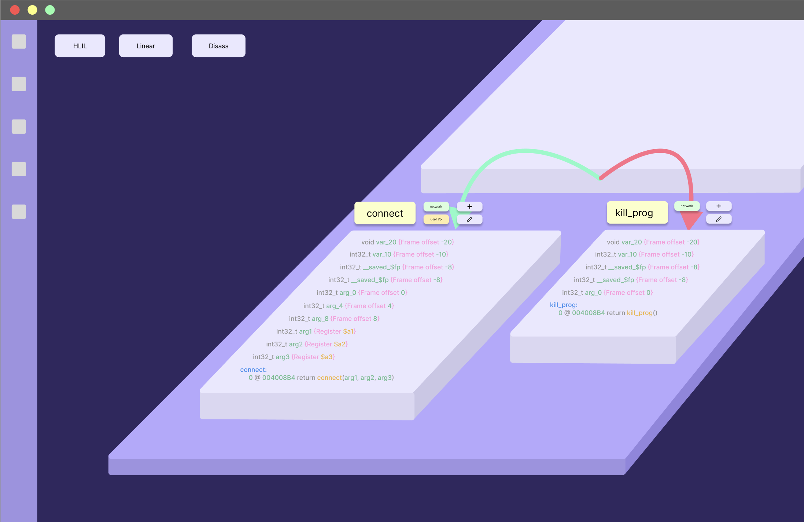
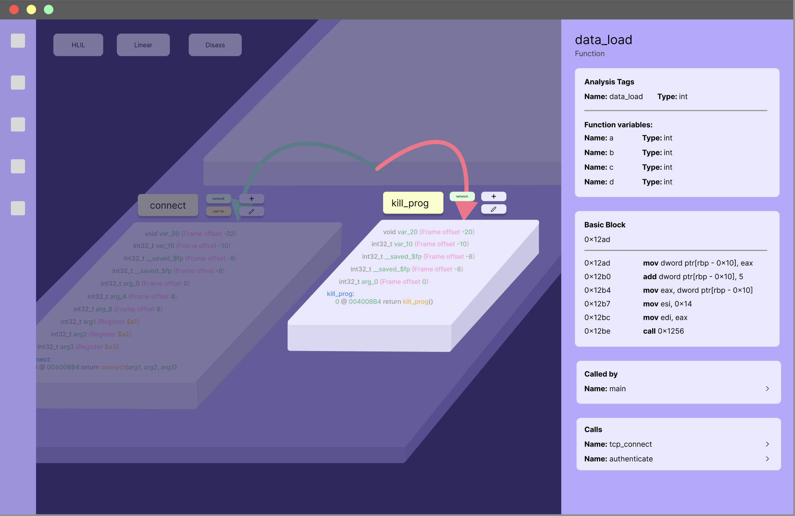
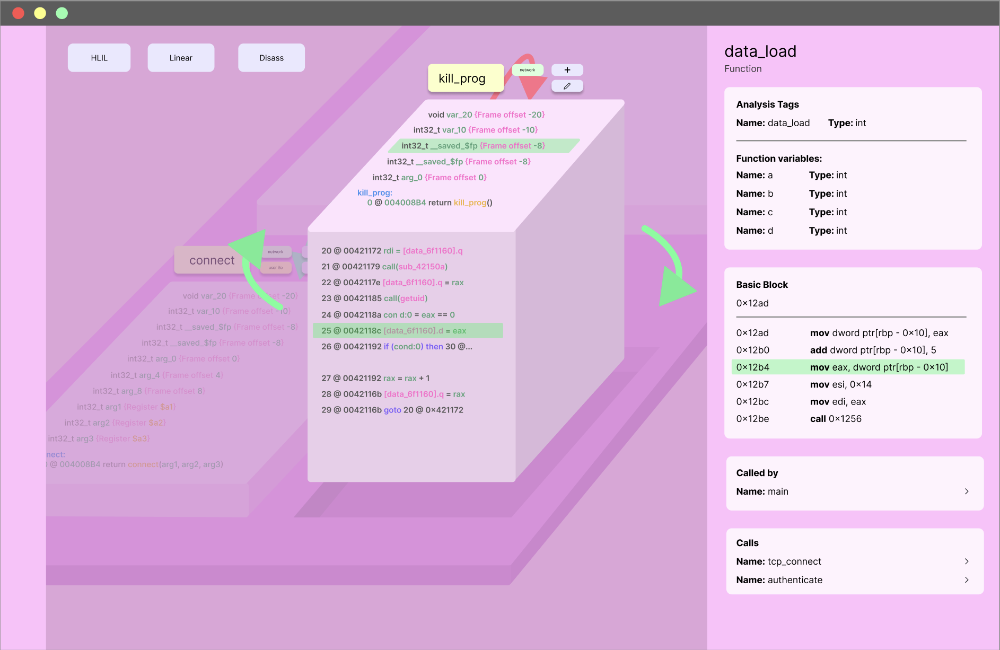
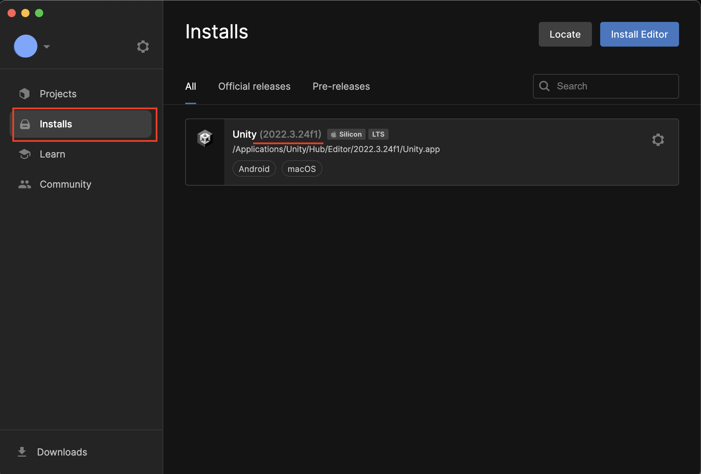
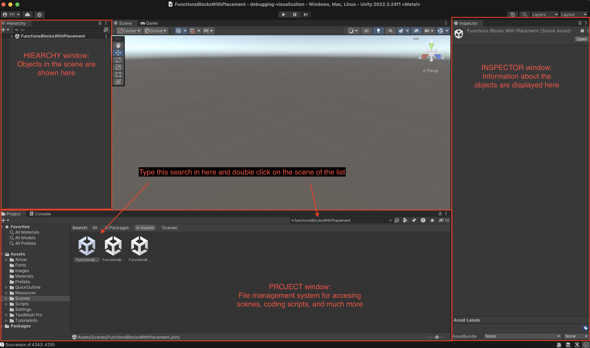

# 👩🏾‍💻 BugVis - Debugging Visualization

How might we make binary analysis a more intuitive and enjoyable process for cybersecurity researchers?

We incorporated multi-dimensional information visualization into a control-flow graph to provide security researchers with a navigable, interactive, and context-rich interface for binary analysis.

## Designs

[Link to the project Figma](https://www.figma.com/design/xlExUXZTqKFArgooRg7GiP/Debugging-Visualization-24S?node-id=1-154&t=oRgPMnxdMIGSxa8K-0)

#### Basic View - purple theme


#### Block onSelect with side panel - purple theme


#### Block extruding and rotation - pink theme


## Architecture
### Tech Stack 🥞
The app is built using `Unity` and `C#` language. Given a `JSON` file that describes the relations of basic blocks of assembly code, produced by the tool `angr`, our interface parses the graph information to instantiate interactable blocks on the scene.

#### Packages 📦
* No external libraries or packages are used in the project. External Unity Assets are already included in the project files and do not require any additional instalation

### File Structure

```
├──[debugging-visualization]/   # root directory
|  └──[Assets]/                 # where most of the project files are found
|       └──[Scripts]/           # where all the source code lives
|       └──[Scenes]/            # all the scenes with isolated tests and integrations
|       └──[Resources]/         # where all original JSON files are held
|  └──[README]                  # this README file
```

For more detailed documentation on our file structure and specific functions in the code, feel free to check the project files themselves.

---
## Setup Steps
1. Clone repo by running `git clone https://github.com/dali-lab/<debugging-visualization>.git` in your terminal and `cd <debugging-visualization>`

2. Download the latest version of [Unity Hub](https://unity.com/download) and then make sure to install version `2022.3.24f1` of the Unity Editor in the hub


3. Once the right version of the editor is installed, switch back to the `Projects` tab and click `Add`. Make sure to locate the folder in your computer generated by when you cloned this git repository

4. The editor with the project should automatically open right after loading its folder. If it does not open, simply select `debugging-visualization` from the list

5. When the editor opens, locate the `Projects` window. Type in the search bar `FunctionsBlocksWithPlacement` and double-click on the **first** item of the list. Make sure that that's exactly what it says at the very top of your editor to ensure you're in the appropratiate scene, and not something like "FunctionsBlocksWithPlacement_2d3d" or "FunctionsBlocksWithPlacement_backup"


6. To run the application, click on the `play-icon` button and switch to the `GAME` window if the editor doesn't display it automatically. To stop running, click on the same icon a second time.


7. The scene entitled `FunctionsBlocksWithPlacement` is our latest, most integrated scene so far. Feel free to explore other test scenes in the repository

---


## Using the tool

We currently allow for 3 different modes:
- Navigation (default)
- Selection
- Rotation

Whenever there is no displayed panel to the right of the screen, the user is in `Navigation` mode and can use the following controls to get around.

- `SPACE + Left-mouse click-and-drag motion:` translates the camera position accross the scene
- `Mouse/touchpad scroll:` zooms in and out
- `AWSD` keyboard movements are available but need to be enabled by selecting the camera object in the Hierachy panel, and then ticking the box `Active Keyboard Movement` in the Inspector panel all the way down. The parameter `Keyboard Pan Speed` in the same region and can also be altered for faster/slower movement
- `SHIFT + Left-mouse click on a CodeBlock`: toggles a highlight option with a yellow outline. If two adjancet blocks are highlighted, the arrow that connects the two will also have the bright outline
- `Left-mouse click on a CodeBlock`: transitions the user into `Selection` mode for a given block

While in this mode, a Panel is shown to the right of the screen with that blocks information and all navigation controls are disabled. The user can then:
- `Left-mouse click on a different CodeBlock`: this will keep the user in `Selection` mode, now displaying information of the most recently clicked block on the right-most Panel
- `R keyboard key`: enables and disables the `Rotation` mode for a particular selected block.

While in this mode, using `Left-mouse click-and-drag motion` will rotate the camera around the expanded block in the horizontal axis X and Z.

Pressing `ESPACE` or clicking on the `X` symbol on any UI Panel will always return the user to the default `Navigation` mode.

Finally, pressing `Q` at any moment switches the camera view from a default perspective one, to a flat, 2D top-view of the graph.

---
## Deployment 🚀
Our team does not have yet a deployed version of this application. An executable file of the visualization tool can be built using the `Unity Build Settings`, once configured. Efforts to do this configuration and have a web-deployed version of this project will continue in the Fall term.

## Authors

* Eijo Kondi, Project Manager
* Daniel Lubliner, Designer
* Devon Starr, Mentor Developer
* Flora Gan, Developer
* Lydia Jin, Developer
* Felipe Pavanelli, Developer


## Acknowledgments 🤝
We would like to thank our partners in this project, Prof Christophe Hauser and Graduate Student Wei-Cheng Wu for their collaboration, patience, and immense eagerness to figure out 3D visualizations together.

---
Designed and developed by [@DALI Lab](https://github.com/dali-lab)
